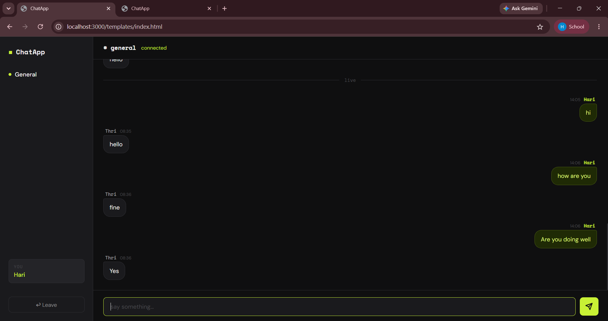
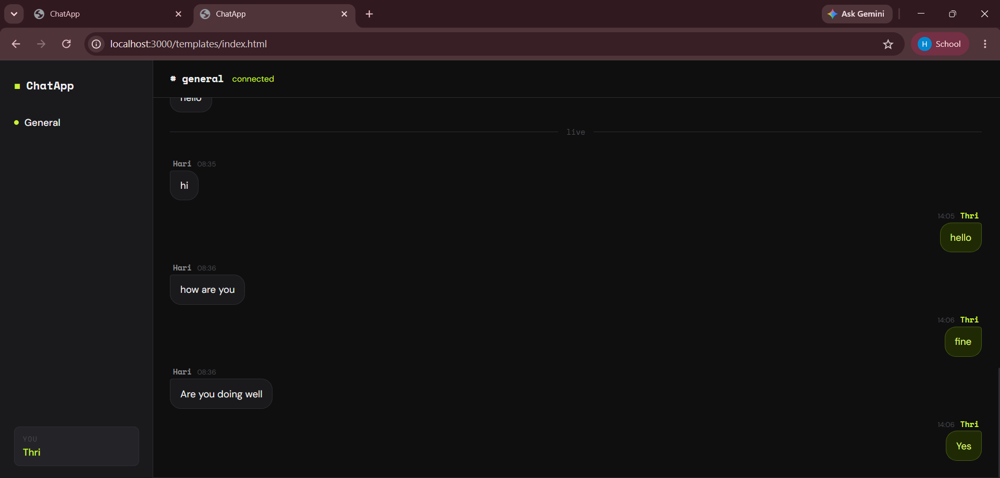

# ChatApp - Real Time Chat Application

## Tech Stack
- C++ (TCP Server, SQLite)
- Python (WebSocket Bridge)
- HTML, CSS, JavaScript (Frontend)

## How to Run
1. `./server` — Start C++ server
2. `python app.py` — Start WebSocket bridge
3. `python3 -m http.server 3000` — Start HTTP server
4. Open `http://localhost:3000/templates/index.html`

## Features
- Real time messaging between multiple users
- Chat history saved in SQLite database
- Clean modern UI

## Screenshots

